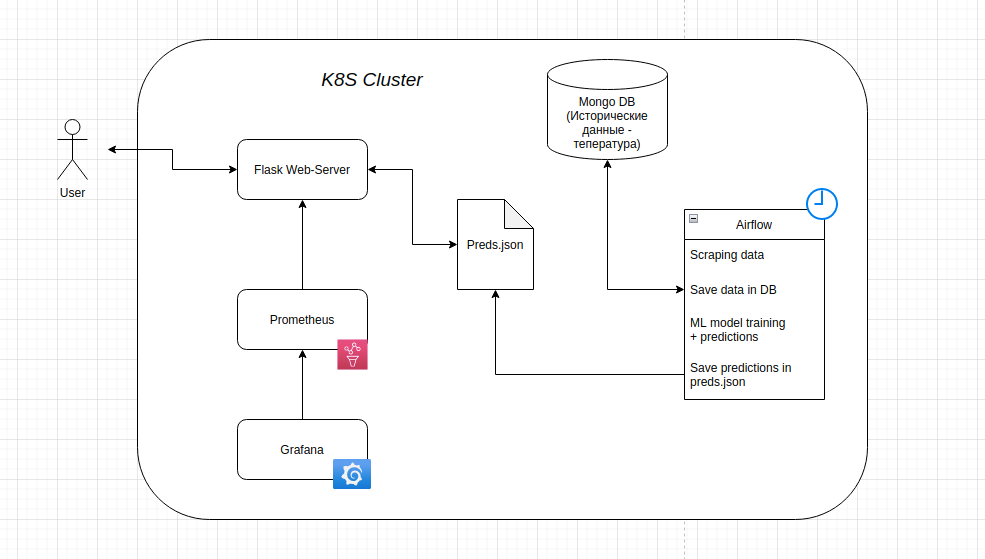
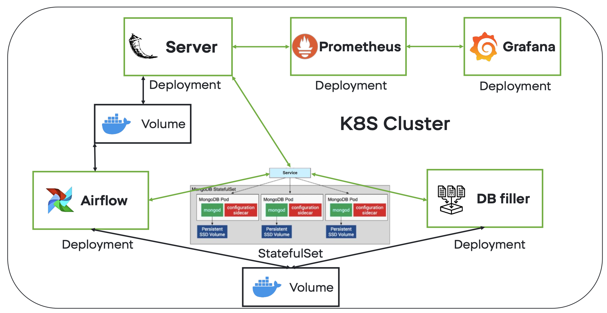
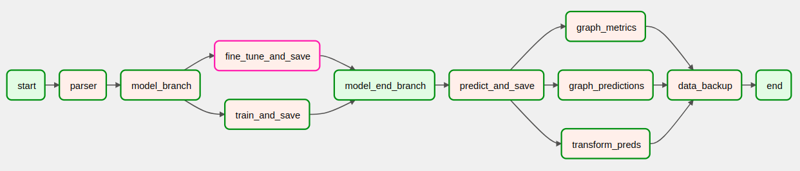

## Weather forecast 

## Architecture

All of these components are deployed in a `kubernetes` cluster.

### Overall description 
The whole project so far consists of the following services: 
* Database (MongoDB)
* The database filler, which is supposed to run once in order to fill the db with the historical data 
* Server written in Flask, responsible for handling http requests 
* Pipline (the core of the whole project), scrapes online data once a day, (re)trains an ML model, infers incoming data

Each service runs in a separate Docker contianer. To assemble the project, just type `docker-compose up` in the project's directory. 

## The following 4 containers will be launched:
* database
    - Mongo database
* placeholder database
    - Fills the database to the beginning of the data from [data/](./data) and exits
* pipeline
    - Runs an airflow configured to run a pipeline once a day to update the weather
* server
    - Using flask renders html pages
    - Responds to API requests

## Stages of pipeline
1. **Parsing** 
  Temperature parsing for a new day. 3 attempts are given with a periodicity of 30 minutes. On the 4th attempt, the temperature for the last day is duplicated.
2. **Training** 
  The first time the model is trained from scratch, its weights are saved.  
  Further, the model is simply retrained on the data for the new day.
3. **Forecast** 
  The model makes a forecast for 7 days ahead and the necessary is stored in the database
4. **Creating content for the server** 
  Post-processing of forecasts, construction of tables and graphs.
5. **Data backup** 
  Saving database tables with the history of forecasts in csv in case of a container crash.

